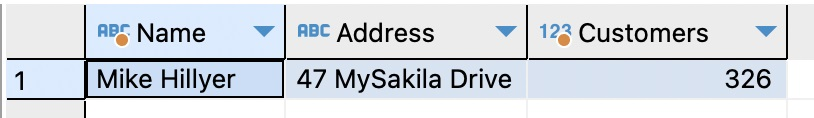
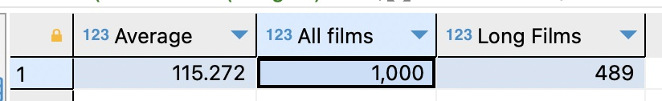
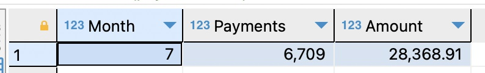

# Домашнее задание к занятию "SQL. Часть 2" - Сторожев Алексей

# Задание 1
Одним запросом получите информацию о магазине, в котором обслуживается более 300 покупателей, и выведите в результат следующую информацию:

- фамилия и имя сотрудника из этого магазина;
- город нахождения магазина;
- количество пользователей, закреплённых в этом магазине;

# Решение
``` sql
SELECT CONCAT(s2.first_name, ' ', s2.last_name) AS Name, 
       a.address                                AS Address, 
       COUNT(c.store_id)                        AS Customers FROM store s 
JOIN customer c ON s.store_id = c.store_id 
JOIN staff s2   ON s.manager_staff_id = s2.staff_id 
JOIN address a  ON s.address_id = a.address_id 
GROUP BY c.store_id 
HAVING COUNT(c.store_id) > 300;
```


# Задание 2
Получите количество фильмов, продолжительность которых больше средней продолжительности всех фильмов.

# Решение
``` sql
SELECT (SELECT  AVG(`length`) from film) AS Average, 
       (SELECT COUNT(1) from film)       AS 'All films', 
       COUNT(1)                          AS 'Long Films' FROM film  WHERE `length` > (SELECT AVG(`length`) from film) ;
```


# Задание 3
Получите информацию, за какой месяц была получена наибольшая сумма платежей, и добавьте информацию по количеству аренд за этот месяц.

# Решение
``` sql
SELECT MONTH(payment_date) AS Month, 
       COUNT(payment_id)   As Payments, 
       SUM(amount)         AS Amount FROM payment
GROUP BY MONTH(payment_date) 
ORDER BY COUNT(payment_id)  DESC LIMIT 1 ;
```

