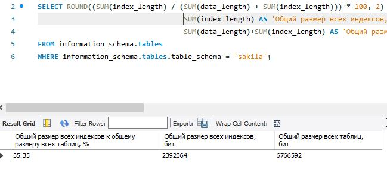
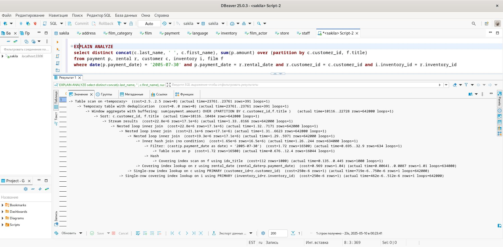
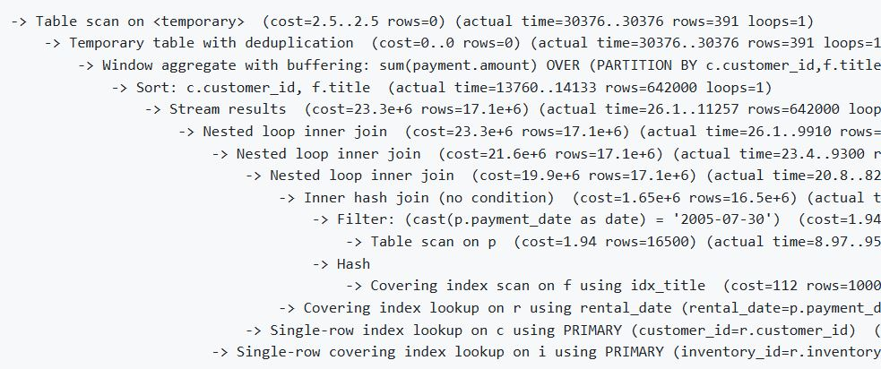
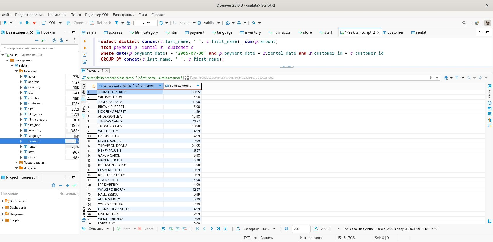
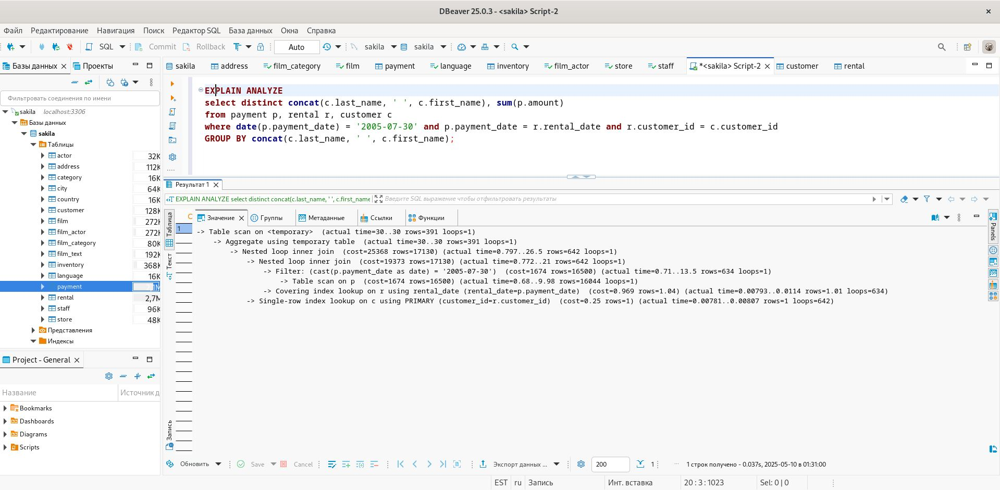

# Домашнее задание к занятию "Индексы" - Сторожев Алексей

# Задание 1
Напишите запрос к учебной базе данных, который вернёт процентное отношение общего размера всех индексов к общему размеру всех таблиц.

# Решение
``` sql
SELECT ROUND((SUM(index_length) / (SUM(data_length) + SUM(index_length))) * 100, 2) AS 'Размер индексов к общему размеру таблиц, %', 
                                   SUM(index_length) AS 'Общий размер всех индексов, бит', 
                                   SUM(data_length)+SUM(index_length) AS 'Общий размер всех таблиц, бит'
FROM information_schema.tables
WHERE information_schema.tables.table_schema = 'sakila';
```



# Задание 2
Выполните explain analyze следующего запроса:
``` sql
select distinct concat(c.last_name, ' ', c.first_name), sum(p.amount) over (partition by c.customer_id, f.title)
from payment p, rental r, customer c, inventory i, film f
where date(p.payment_date) = '2005-07-30' 
  and p.payment_date = r.rental_date 
  and r.customer_id = c.customer_id 
  and i.inventory_id = r.inventory_id
```
перечислите узкие места;
оптимизируйте запрос: внесите корректировки по использованию операторов, при необходимости добавьте индексы.

# Решение
Результат запроса с анализом.
```sql
EXPLAIN ANALYZE
select distinct concat(c.last_name, ' ', c.first_name), sum(p.amount) over (partition by c.customer_id, f.title)
from payment p, rental r, customer c, inventory i, film f
where date(p.payment_date) = '2005-07-30' and p.payment_date = r.rental_date and r.customer_id = c.customer_id and i.inventory_id = r.inventory_id
```


По выводу команды обнаружены следующие узкие места:

Дублирующие данные (Temporary table with deduplication). Была создана временная таблица с удалёнными дублирующими данными. На что было потрачено очень много времени (actual time=30376..30376).
Отсутствие группировки. Использованы оконные функции (Window aggregate with buffering) вместо группировки. Затрачено времени (actual time=13760..29069). Если использовать группировку, то мы получим уменьшение количества строк и соответственно уменьшение времени обработки.
Сортировка (Sort) по двум полям c.customer_id, f.title. Затрачено времени (actual time=13760..14133).


Проведена оптимизация:

удалена сортировка,
удалена таблица film,
удалена таблица inventory,
добавлена группировка.
Результат оптимизированного запроса.
```sql
select distinct concat(c.last_name, ' ', c.first_name), sum(p.amount)
from payment p, rental r, customer c
where date(p.payment_date) = '2005-07-30' and p.payment_date = r.rental_date and r.customer_id = c.customer_id
GROUP BY concat(c.last_name, ' ', c.first_name);
```


Реультат запроса с анализом.
``sql
EXPLAIN ANALYZE
select distinct concat(c.last_name, ' ', c.first_name), sum(p.amount)
from payment p, rental r, customer c
where date(p.payment_date) = '2005-07-30' and p.payment_date = r.rental_date and r.customer_id = c.customer_id
GROUP BY concat(c.last_name, ' ', c.first_name);
```



